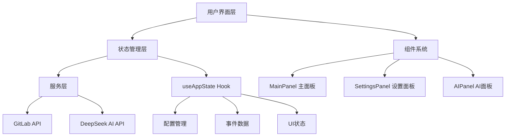

# GitLab 周报生成器 v2.0

<div align="center">

一个基于 **DeepSeek AI** 的现代化 GitLab 工作周报自动生成工具

</div>

## 📋 项目概述

这是一个功能强大的 GitLab 工作周报生成器，采用现代化的前端技术栈构建。项目集成了 **DeepSeek AI** 智能分析能力，能够自动分析 GitLab 活动数据并生成专业的工作周报。支持 **Tampermonkey 脚本模式** 和 **独立 Web 应用模式** 两种运行方式，满足不同场景的使用需求。

### ✨ 核心特性

- 🤖 **AI 智能生成**: 基于 DeepSeek AI 模型，智能分析 GitLab 活动数据
- 📊 **数据可视化**: 直观展示代码提交、合并请求、问题处理等统计信息
- 🎨 **现代化 UI**: 仿 macOS 设计风格，支持深色/浅色主题切换
- 🔧 **灵活配置**: 支持自定义筛选条件、排序方式和 AI 提示词
- 📱 **响应式设计**: 完美适配桌面端和移动端设备
- 🚀 **双模式部署**: 支持油猴脚本和独立 Web 应用两种运行模式

## 项目交互

1. 仿照 MacOS 的 UI 和 交互设计
2. 主面板 Gitlab Events 为上下两部分, 上半部分为筛选条件, 下半部分为事件列表， 带分页器和排序及筛选

- 筛选条件:
  - 时间范围: 默认最近7天, 可选择最近30天, 最近90天, 最近180天, 最近365天
  - 事件类型: 默认全部, 可选择 Merge Request, Issue, Commit, Comment, 等
  - 事件状态: 默认全部, 可选择 Open, Closed, Merged, 等
  - 事件标签: 默认全部, 可选择特定标签

3. 设置面板， 通过主面板的设置按钮打开, 设置面板包含以下内容:

- Gitlab 项目地址: 输入 Gitlab 项目地址, 用于获取 Gitlab 事件数据
- Gitlab 个人访问令牌: 输入 Gitlab 个人访问令牌, 用于获取 Gitlab 事件数据
- DeepSeek API Key: 输入 DeepSeek API Key, 用于生成 AI 周报
- 默认提示词: 输入默认提示词, 用于生成 AI 周报
- token 数量限制
- 使用的模型

4. AI 面板, 通过主面板的 AI 按钮打开, 包含以下内容:

- 提示词: 输入增强提示词
- 生成按钮: 点击后生成 AI 周报
- 生成结果: 显示 AI 周报生成结果， 可以一键复制
- 显示本次使用 token 数量
- 重新生成按钮: 点击后重新生成 AI 周报

## 🏗️ 技术架构

### 核心技术栈

| 技术栈         | 版本  | 用途                         |
| -------------- | ----- | ---------------------------- |
| **React**      | 18.2+ | 前端框架，构建用户界面       |
| **TypeScript** | 5.2+  | 类型安全的 JavaScript 超集   |
| **Vite**       | 5.2+  | 现代化构建工具，快速开发体验 |
| **Less**       | 4.2+  | CSS 预处理器，样式管理       |
| **ESLint**     | 8.57+ | 代码质量检查工具             |
| **Prettier**   | 3.2+  | 代码格式化工具               |
| **Stylelint**  | 16.3+ | CSS/Less 代码规范检查        |

### 架构设计



### 📁 项目结构

```
tm_gitlabWeeklyReport_v2/
├── 📁 src/                      # 源代码目录
│   ├── 📁 components/           # React 组件库
│   │   ├── 📁 AIPanel/          # AI 周报生成面板
│   │   ├── 📁 ConfigForm/       # 配置表单组件
│   │   ├── 📁 MainPanel/        # 主面板组件
│   │   ├── 📁 Modal/            # 模态框组件
│   │   ├── 📁 Pagination/       # 分页组件
│   │   └── 📁 SettingsPanel/    # 设置面板组件
│   ├── 📁 hooks/                # 自定义 React Hooks
│   │   └── 📄 useAppState.ts    # 应用状态管理 Hook
│   ├── 📁 services/             # API 服务层
│   │   ├── 📄 deepseek-api.ts   # DeepSeek AI API 服务
│   │   └── 📄 gitlab-api.ts     # GitLab API 服务
│   ├── 📁 types/                # TypeScript 类型定义
│   │   └── 📄 index.ts          # 全局类型定义
│   ├── 📁 constants/            # 常量配置
│   │   └── 📄 index.ts          # 应用常量定义
│   ├── 📁 utils/                # 工具函数库
│   │   └── 📄 index.ts          # 通用工具函数
│   ├── 📁 data/                 # 数据文件
│   │   ├── 📄 mockData.ts       # 模拟数据
│   │   └── 📄 res-temp-events.json # 事件模板数据
│   ├── 📄 App.tsx               # 主应用组件
│   ├── 📄 main.tsx              # 应用入口文件
│   ├── 📄 userscript.ts         # 油猴脚本入口
│   ├── 📄 App.less              # 全局样式
│   └── 📄 index.less            # 基础样式
├── 📁 dist/                     # 构建输出目录
│   ├── 📁 web/                  # Web 应用构建产物
│   └── 📁 userscript/           # 油猴脚本构建产物
├── 📄 package.json              # 项目依赖配置
├── 📄 vite.config.ts            # Vite 构建配置
├── 📄 tsconfig.json             # TypeScript 配置
├── 📄 .eslintrc.cjs             # ESLint 配置
├── 📄 .prettierrc               # Prettier 配置
├── 📄 .stylelintrc.json         # Stylelint 配置
└── 📄 README.md                 # 项目文档
```

## 🔧 架构设计特点

### 1. 状态管理架构

- 采用 **React Context + useReducer** 模式
- 分离关注点：配置状态、UI状态、事件数据状态
- 支持持久化存储（localStorage/GM_setValue）

### 2. 组件化设计

- **业务组件**：专注特定功能的复合组件
- **UI组件**：可复用的基础组件
- 每个组件包含 `.tsx` + `.less`

### 3. 服务层设计

- **GitLab API 服务**：处理 GitLab 数据获取
- **DeepSeek API 服务**：处理 AI 周报生成
- 统一错误处理和重试机制

### 4. 环境适配

- **双模式支持**：Tampermonkey 脚本模式 + Web 应用模式
- **环境适配器**：统一处理不同环境的 API 调用和存储

## 🚀 构建流程

### 开发模式

- `npm run dev` - Web 应用开发模式
- 支持热重载和实时预览

### 生产构建

- `npm run build:userscript` - 构建油猴脚本
- `npm run build:web` - 构建 Web 应用
- 自动代码压缩和优化

### 代码质量

- **ESLint**: TypeScript + React 规则
- **Prettier**: 代码格式化
- **Stylelint**: Less 样式规范
- **Husky**: Git hooks 自动检查

## 🚀 快速开始

### 📋 环境要求

- **Node.js**: >= 18.0.0
- **npm**: >= 8.0.0 (推荐使用 npm 10.9.2+)
- **浏览器**: Chrome/Firefox/Safari/Edge (支持 ES2020+)
- **Tampermonkey**: >= 4.0 (仅油猴脚本模式需要)

### 📦 安装与运行

#### 1. 克隆项目

```bash
git clone https://github.com/imzusheng/tm_gitlabWeeklyReport.git
cd tm_gitlabWeeklyReport_v2
```

#### 2. 安装依赖

```bash
npm install
```

#### 3. 开发模式

```bash
# 启动开发服务器 (http://localhost:3000)
npm run dev
```

#### 4. 构建项目

```bash
# 构建 Web 应用版本
npm run build:web

# 构建油猴脚本版本
npm run build:userscript

# 构建所有版本
npm run build
```

#### 5. 代码检查与格式化

```bash
# ESLint 检查
npm run lint
npm run lint:fix

# Prettier 格式化
npm run format

# Stylelint 检查
npm run stylelint
npm run stylelint:fix

# TypeScript 类型检查
npm run type-check
```

## ⚙️ 配置说明

### 🔑 GitLab 配置

1. **获取 GitLab Personal Access Token**

   - 登录 GitLab → 用户设置 → Access Tokens
   - 创建新 Token，勾选 `read_api` 权限
   - 复制生成的 Token

2. **配置 GitLab 信息**
   ```typescript
   {
     "gitlabUrl": "https://gitlab.example.com",
     "gitlabToken": "your-personal-access-token"
   }
   ```

### 🤖 DeepSeek AI 配置

1. **获取 DeepSeek API Key**

   - 访问 [DeepSeek 官网](https://platform.deepseek.com/)
   - 注册账号并获取 API Key

2. **配置 AI 参数**
   ```typescript
   {
     "deepseekApiKey": "your-deepseek-api-key",
     "model": "deepseek-chat",
     "maxTokens": 2000,
     "temperature": 0.7
   }
   ```

## 📖 使用指南

### 🌐 Web 应用模式

1. 启动开发服务器或部署到服务器
2. 在设置面板配置 GitLab 和 DeepSeek 信息
3. 在主面板筛选需要的 GitLab 事件
4. 点击 AI 按钮生成工作周报

### 🔧 油猴脚本模式

1. 安装 Tampermonkey 浏览器扩展
2. 构建油猴脚本版本：`npm run build:userscript`
3. 在 Tampermonkey 中导入 `dist/userscript/gitlab-weekly-report.user.js`
4. 访问任意 GitLab 页面，脚本会自动注入界面

## 🎯 核心功能模块

### 📊 主面板 (MainPanel)

- **智能筛选**: 支持按时间范围、事件类型、状态、标签等多维度筛选
- **数据可视化**: 分页显示 GitLab 事件列表，支持多种排序方式
- **主题系统**: 支持浅色/深色/跟随系统主题，提供最佳视觉体验
- **响应式布局**: 完美适配桌面端和移动端设备

### ⚙️ 设置面板 (SettingsPanel)

- **GitLab 集成**: 项目地址、个人访问令牌配置
- **AI 模型配置**: DeepSeek API Key、模型参数、Token 限制设置
- **提示词管理**: 自定义 AI 生成提示词，支持模板保存
- **数据持久化**: 配置信息本地存储，支持导入导出

### 🤖 AI 面板 (AIPanel)

- **智能分析**: 基于 DeepSeek AI 深度分析 GitLab 活动数据
- **周报生成**: 一键生成结构化、专业化工作周报
- **多轮对话**: 支持追加提示词，优化生成结果
- **结果管理**: 支持一键复制、重新生成、历史记录等功能
- **Token 统计**: 实时显示 API 调用消耗情况

## 🛠️ 开发指南

### 📝 代码规范

项目采用严格的代码规范，确保代码质量和一致性：

- **TypeScript**: 启用严格模式，要求完整的类型定义
- **ESLint**: 基于 `@typescript-eslint` 的代码质量检查
- **Prettier**: 统一的代码格式化规则
- **Stylelint**: CSS/Less 样式规范检查

### 🏗️ 构建配置

- **Vite**: 现代化构建工具，支持 HMR 和快速构建
- **双模式构建**: 自动适配 Web 应用和油猴脚本两种部署模式
- **路径别名**: `@/` 映射到 `src/` 目录，简化导入路径
- **环境变量**: 支持开发和生产环境配置

### 🔧 推荐开发工具

- **编辑器**: VS Code
- **浏览器**: Chrome DevTools / Firefox Developer Tools
- **版本控制**: Git + GitHub/GitLab
- **包管理**: npm (推荐) / yarn / pnpm

### 📋 开发流程

1. **功能开发**

   ```bash
   # 创建功能分支
   git checkout -b feature/new-feature

   # 开发过程中持续检查
   npm run lint
   npm run type-check
   ```

2. **代码提交**

   ```bash
   # 格式化代码
   npm run format

   # 提交代码
   git add .
   git commit -m "feat: add new feature"
   ```

3. **构建测试**

   ```bash
   # 构建所有版本
   npm run build

   # 预览构建结果
   npm run preview
   ```

## 🤝 贡献指南

我们欢迎所有形式的贡献！请遵循以下指南：

## 📊 项目状态分析

### ✅ 项目优势
- **现代化技术栈**: 使用 React 18 + TypeScript + Vite，具备良好的开发体验
- **完善的代码质量工具**: 配置了 ESLint、Prettier、Stylelint 等代码规范工具
- **双模式构建**: 支持 Web 应用和 Tampermonkey 用户脚本两种部署方式
- **类型安全**: TypeScript 严格模式，确保代码类型安全
- **模块化架构**: 清晰的组件结构和服务层分离

### 🔧 待优化项目

#### 1. 代码质量优化
- **类型定义优化**: 部分地方使用了 `any` 类型，建议使用更具体的类型定义
  - `src/App.tsx` 中的 `handleSaveSettings` 和 `handleSortChange` 函数参数
  - `src/types/index.ts` 中的 `attachment`、`resolved_by` 等字段
- **调试代码清理**: 移除生产环境不需要的 console 语句
  - `src/hooks/useAppState.ts` 中的错误日志
  - `src/utils/request.ts` 中的警告日志
  - `vite.config.ts` 中的代理调试日志

#### 2. 依赖管理优化
- **ESLint 配置修复**: 当前 ESLint 配置存在依赖问题，需要安装缺失的 TypeScript ESLint 包
- **依赖版本锁定**: 建议在 `package.json` 中锁定关键依赖版本

#### 3. 文件清理
- **临时文件清理**: 删除 `temp-res-events.json` 临时测试文件
- **Git 忽略优化**: 完善 `.gitignore` 文件，添加更多常见的忽略项

#### 4. 性能优化建议
- **组件懒加载**: 对大型组件实现 React.lazy 懒加载
- **API 请求优化**: 实现请求缓存和防抖机制
- **Bundle 分析**: 定期分析打包体积，优化依赖引入

#### 5. 用户体验优化
- **错误边界**: 添加 React Error Boundary 处理组件错误
- **加载状态**: 优化加载状态的用户反馈
- **国际化支持**: 考虑添加多语言支持

### 🎯 优化优先级
1. **高优先级**: 修复 ESLint 配置，清理临时文件
2. **中优先级**: 优化类型定义，移除调试代码
3. **低优先级**: 性能优化，用户体验提升

## 🤝 贡献指南
### 🐛 报告问题

- 使用 [GitHub Issues](https://github.com/imzusheng/tm_gitlabWeeklyReport/issues) 报告 Bug
- 提供详细的复现步骤和环境信息
- 包含错误截图或日志信息

### 💡 功能建议

- 在 Issues 中提出新功能建议
- 详细描述功能需求和使用场景
- 讨论实现方案的可行性

### 🔧 代码贡献

1. Fork 项目到你的 GitHub 账号
2. 创建功能分支：`git checkout -b feature/amazing-feature`
3. 提交更改：`git commit -m 'feat: add amazing feature'`
4. 推送分支：`git push origin feature/amazing-feature`
5. 创建 Pull Request

### 📝 提交规范

使用 [Conventional Commits](https://conventionalcommits.org/) 规范：

- `feat`: 新功能
- `fix`: Bug 修复
- `docs`: 文档更新
- `style`: 代码格式调整
- `refactor`: 代码重构
- `test`: 测试相关
- `chore`: 构建工具或辅助工具的变动

## 🚀 语义化发布

本项目采用 **语义化发布 (Semantic Release)** 和 **约定式提交 (Conventional Commits)** 来自动管理版本号和生成发布记录。

### 📝 提交信息规范

提交信息必须遵循以下格式：

```
<type>[optional scope]: <description>

[optional body]

[optional footer(s)]
```

**示例：**

```bash
# 新功能 (会增加 minor 版本)
git commit -m "feat: add weekly report export functionality"

# 修复 bug (会增加 patch 版本)
git commit -m "fix: resolve date parsing issue in report generation"

# 破坏性变更 (会增加 major 版本)
git commit -m "feat!: change API response format"

# 文档更新 (不会触发版本发布)
git commit -m "docs: update installation instructions"
```

### 🔄 自动化流程

当代码推送到主分支时，CI/CD 会自动：

1. 🧪 运行测试和代码检查
2. 📊 分析提交信息确定版本类型
3. 🏷️ 自动生成版本号和 Git 标签
4. 📝 更新 CHANGELOG.md
5. 🚀 创建 GitHub Release
6. 📦 更新相关文件中的版本号

### 📖 详细开发指南

查看 [CONTRIBUTING.md](CONTRIBUTING.md) 了解完整的开发流程和规范。

## ❓ 常见问题

### Q: 如何获取 GitLab Personal Access Token？

**A**: 登录 GitLab → 用户设置 → Access Tokens → 创建新 Token，勾选 `read_api` 权限。

### Q: DeepSeek API 调用失败怎么办？

**A**: 检查 API Key 是否正确，确认账户余额充足，网络连接正常。

### Q: 油猴脚本无法在 GitLab 页面显示？

**A**: 确认 Tampermonkey 已启用，脚本匹配规则正确，页面完全加载后再检查。

### Q: 如何自定义 AI 生成的周报格式？

**A**: 在设置面板中修改默认提示词，或在 AI 面板中添加自定义提示词。

## 📄 许可证

本项目基于 [MIT License](LICENSE) 开源协议。

---

<div align="center">

**如果这个项目对你有帮助，请给我们一个 ⭐ Star！**

</div>
