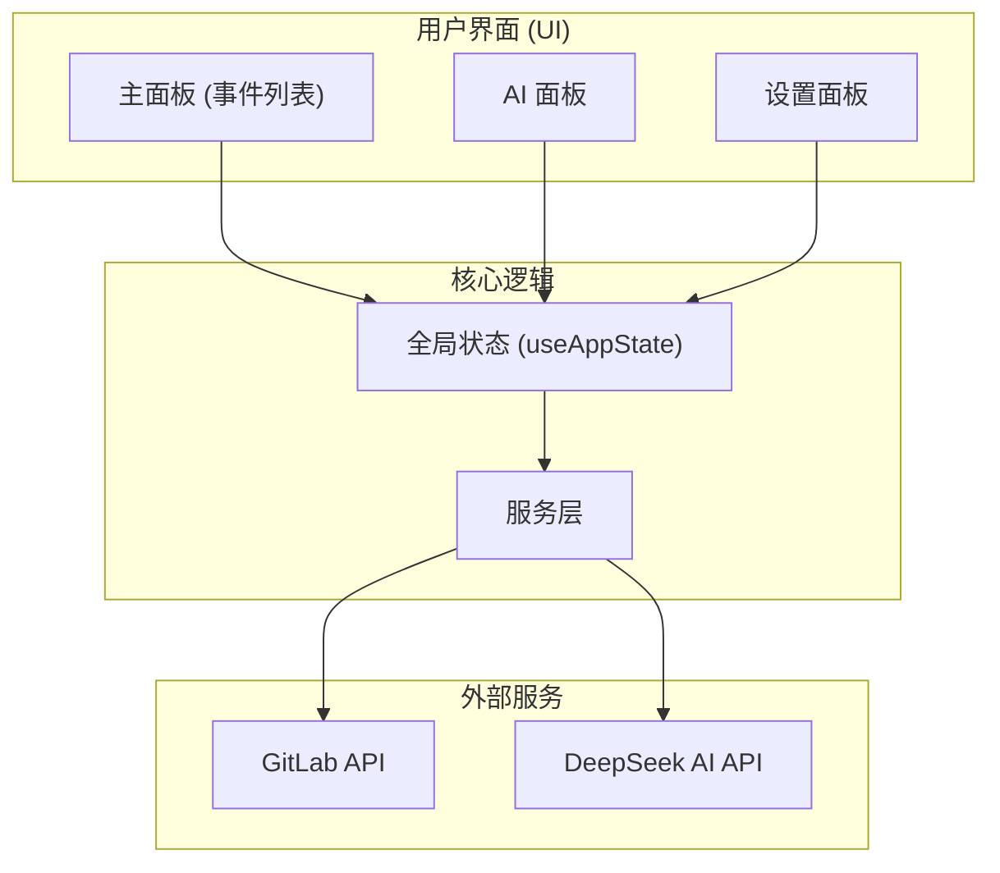

# GitLab 周报生成器 v2.0

<div align="center">

一个基于 **DeepSeek AI** 的现代化 GitLab 工作周报自动生成工具

</div>

## 📋 项目概述

这是一个功能强大的 GitLab 工作周报生成器，采用现代化的前端技术栈构建。项目集成了 **DeepSeek AI** 智能分析能力，能够自动分析 GitLab 活动数据并生成专业的工作周报。支持 **Tampermonkey 脚本模式** 和 **独立 Web 应用模式** 两种运行方式，满足不同场景的使用需求。

### ✨ 核心特性

- **🤖 AI 智能生成**: 基于 DeepSeek AI 模型，智能分析 GitLab 活动数据。
- **📊 数据可视化**: 直观展示 GitLab 事件，支持丰富的筛选和排序。
- **🎨 现代化 UI**: 仿 macOS 设计风格，支持亮色/暗色/系统主题切换。
- **🔧 双模式运行**: 支持作为油猴脚本注入或独立的 Web 应用运行。
- **🚀 工程化**: 内置代码规范、自动化测试、CI/CD 和语义化版本发布。

---

## 🚀 快速开始

### 方式一：使用油猴脚本（推荐）

1.  **安装 Tampermonkey 浏览器扩展**:

    - [Chrome 扩展商店](https://chrome.google.com/webstore/detail/tampermonkey/dhdgffkkebhmkfjojejmpbldmpobfkfo)
    - [Firefox 附加组件](https://addons.mozilla.org/en-US/firefox/addon/tampermonkey/)
    - [Edge 扩展商店](https://microsoftedge.microsoft.com/addons/detail/tampermonkey/iikmkjmpaadaobahmlepeloendndfphd)

2.  **安装脚本**:
    点击下面的链接即可自动安装最新版本。

    **[📥 安装 GitLab 周报生成器](https://github.com/imzusheng/tm_gitlabWeeklyReport/raw/v2/dist/userscript/gitlab-weekly-report.user.js)**

3.  **使用**:
    - 访问你的 GitLab 项目页面，脚本图标将出现在右下角。
    - 首次使用时，请在设置面板中配置必要的凭据。

### 方式二：本地开发运行

```bash
# 1. 克隆项目
git clone https://github.com/imzusheng/tm_gitlabWeeklyReport.git
cd tm_gitlabWeeklyReport_v2

# 2. 安装依赖
npm install

# 3. 启动开发服务器
npm run dev

# 4. 打开浏览器访问 http://localhost:3000
```

---

## ⚙️ 配置说明

首次使用时，你需要在设置面板中配置以下信息：

1.  **GitLab 个人访问令牌 (Token)**:

    - **获取方式**: 登录 GitLab → 用户设置 → Access Tokens → 创建新 Token。
    - **所需权限**: 至少需要 `read_api` 权限。

2.  **DeepSeek API Key**:
    - **获取方式**: 访问 [DeepSeek 开放平台](https://platform.deepseek.com/) 注册并创建 API Key。
    - **提示**: DeepSeek 提供免费的 API 额度，足够个人日常使用。

---

## 📖 开发者指南

本部分为希望参与项目开发或深入了解项目内部实现的开发者提供。

### 🏗️ 技术架构

项目采用现代前端技术栈，注重模块化、可维护性和开发效率。

- **核心框架**: React 18 + TypeScript
- **构建工具**: Vite
- **样式方案**: Less + CSS Modules
- **状态管理**: 自定义 React Hooks (`useAppState`)
- **代码规范**: ESLint, Prettier, Stylelint
- **自动化**: Husky, commitlint, semantic-release, GitHub Actions

#### 架构图


```mermaid
graph TB
    subgraph "用户界面 (UI)"
        direction LR
        MainPanel["主面板 (事件列表)"]
        AIPanel["AI 面板"]
        SettingsPanel["设置面板"]
    end

    subgraph "核心逻辑"
        direction TB
        AppState["全局状态 (useAppState)"]
        Services["服务层"]
    end

    subgraph "外部服务"
        direction RL
        GitLabAPI["GitLab API"]
        DeepSeekAPI["DeepSeek AI API"]
    end

    MainPanel --> AppState
    AIPanel --> AppState
    SettingsPanel --> AppState

    AppState --> Services
    Services --> GitLabAPI
    Services --> DeepSeekAPI
```

#### 核心特点

- **模块化架构**: 采用组件化设计，每个功能模块职责单一，易于维护和扩展
- **类型安全**: 完整的 TypeScript 类型定义，确保代码质量和开发体验
- **状态管理**: 使用 React Context + useReducer 架构，按领域分组管理状态
- **响应式设计**: 适配不同屏幕尺寸，优先考虑桌面端体验
- **性能优化**: React.memo、useCallback、useMemo 等优化手段，确保良好性能

### 📁 项目结构

```
tm_gitlabWeeklyReport_v2/
├── 📁 src/                           # 源代码目录
│   ├── 📁 components/                # React 组件
│   │   ├── 📁 MainPanel/             # 主面板组件
│   │   │   ├── 📁 components/        # 主面板子组件
│   │   │   │   ├── 📁 ActionButtons/ # 操作按钮组件
│   │   │   │   ├── 📁 ChangelogView/ # Changelog 视图组件
│   │   │   │   ├── 📁 ChangelogPanel/# Changelog 面板组件
│   │   │   │   ├── 📁 EventRow/      # 事件行组件
│   │   │   │   ├── 📁 EventsList/    # 事件列表组件
│   │   │   │   ├── 📁 EventsView/    # Events 视图组件
│   │   │   │   ├── 📁 FilterSection/ # 筛选区域组件
│   │   │   │   └── 📁 ModeToggle/    # 模式切换组件
│   │   │   └── 📄 index.tsx          # 主面板入口
│   │   ├── 📁 AIPanel/               # AI 面板组件
│   │   ├── 📁 SettingsPanel/         # 设置面板组件
│   │   ├── 📁 Modal/                 # 模态框组件
│   │   ├── 📁 Pagination/            # 分页组件
│   │   ├── 📁 SelectionManager/      # 选择管理器组件
│   │   └── 📁 ConfigStatus/          # 配置状态组件
│   ├── 📁 hooks/                     # 自定义 React Hooks
│   │   ├── 📁 reducers/              # 状态管理 Reducers
│   │   │   ├── 📄 configReducer.ts  # 配置状态管理
│   │   │   ├── 📄 uiReducer.ts      # UI 状态管理
│   │   │   └── 📄 dataReducer.ts    # 数据状态管理
│   │   ├── 📄 useAppState.ts         # 应用主状态钩子
│   │   ├── 📄 useGlobalSelection.ts  # 全局选择钩子
│   │   └── 📄 useAbortableRequest.ts # 可中断请求钩子
│   ├── 📁 context/                   # React Context
│   │   └── 📄 AppContext.tsx         # 应用上下文
│   ├── 📁 services/                  # API 服务层
│   │   ├── 📄 gitlab-api.ts          # GitLab API 服务
│   │   └── 📄 deepseek-api.ts        # DeepSeek API 服务
│   ├── 📁 utils/                     # 工具函数库
│   │   ├── 📄 eventUtils.ts          # 事件处理工具
│   │   ├── 📄 error.ts               # 错误处理工具
│   │   └── 📄 index.ts               # 工具函数导出
│   ├── 📁 types/                     # TypeScript 类型定义
│   ├── 📁 constants/                 # 常量定义
│   ├── 📄 App.tsx                    # 应用根组件
│   ├── 📄 main.tsx                   # Web 应用入口
│   ├── 📄 userscript.ts              # 油猴脚本入口
│   ├── 📄 index.less                 # 全局样式
│   └── 📄 App.module.less            # 应用样式
├── 📁 scripts/                       # 构建脚本
│   ├── 📄 create-license-file.cjs    # 许可证文件生成脚本
│   └── 📄 semantic-version-update.cjs# 语义化版本更新脚本
├── 📁 .github/                       # GitHub Actions 工作流
├── 📁 dist/                          # 构建输出目录
│   ├── 📁 userscript/                # 油猴脚本构建产物
│   └── 📁 web/                       # Web 应用构建产物
├── 📄 vite.config.ts                 # Vite 构建配置
├── 📄 package.json                   # 项目依赖与脚本
├── 📄 tsconfig.json                  # TypeScript 配置
├── 📄 LICENSE                        # MIT 许可证文件
└── 📄 README.md                      # 项目说明文档
```

### 🚀 开发与构建

项目内置了一套完整的开发、检查和构建脚本。

- **启动开发环境**:
  ```bash
  npm run dev
  ```
- **代码质量检查**:
  ```bash
  npm run check         # 运行所有检查
  npm run lint          # ESLint 检查
  npm run stylelint     # Stylelint 检查
  npm run type-check    # TypeScript 类型检查
  npm run format        # Prettier 代码格式化
  npm run check-license # 检查/更新 LICENSE 文件
  ```
- **生产构建**:
  ```bash
  npm run build            # 构建所有版本 (包含 LICENSE 检查)
  npm run build:userscript # 仅构建油猴脚本
  npm run build:web        # 仅构建 Web 应用
  npm run pre-build        # 预构建检查 (LICENSE 文件检查)
  ```

### 📝 提交与发布

项目使用 **Conventional Commits** 规范和 **Semantic Release** 实现自动化版本管理和发布。

- **提交规范**: 提交信息必须遵循 `type(scope): description` 的格式 (例如 `feat: add new button`)。`commitlint` 会在提交时自动检查。
- **主要类型**:
  - `feat`: 新功能 (触发 `minor` 版本更新)
  - `fix`: Bug 修复 (触发 `patch` 版本更新)
  - `BREAKING CHANGE:` (在 commit body 中): 破坏性变更 (触发 `major` 版本更新)
- **自动化流程**: 当代码合并到 `v2` 分支时，GitHub Actions 会自动：
  1.  分析提交信息。
  2.  确定新版本号。
  3.  生成 `CHANGELOG.md`。
  4.  创建 GitHub Release 和 Git 标签。

---

## 🤝 贡献

我们欢迎所有形式的贡献！你可以通过以下方式参与：

- **报告 Bug**: 通过 [GitHub Issues](https://github.com/imzusheng/tm_gitlabWeeklyReport/issues) 提交详细的 Bug 报告。
- **功能建议**: 在 Issues 中提出你的想法和建议。
- **代码贡献**: Fork 项目并提交 Pull Request。请确保你的提交遵循项目的代码和提交规范。

## 📄 许可证

本项目基于 [MIT License](LICENSE) 开源协议。

---

<div align="center">

**如果这个项目对你有帮助，请给我们一个 ⭐ Star！**

</div>
