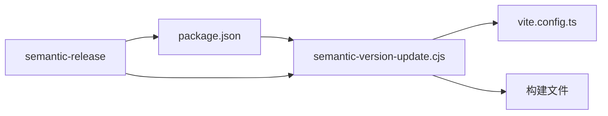

# 构建脚本说明

## semantic-version-update.cjs

**统一版本管理脚本** - 项目中唯一的版本号管理工具，确保所有文件中的版本号保持同步。

### 🎯 设计理念

- **单一数据源**: `package.json` 中的 `version` 字段是唯一的版本号来源
- **自动同步**: 所有其他文件中的版本号都从 `package.json` 同步
- **简化管理**: 开发者无需手动维护多个文件中的版本号
- **语义化发布**: 配合 semantic-release 实现完全自动化的版本管理

### ✨ 功能特性

- ✅ 从 `package.json` 读取版本号（唯一数据源）
- ✅ 自动同步到 `vite.config.ts` 中的 userscript header
- ✅ 自动同步到构建后的 userscript 文件
- ✅ 中文友好的日志输出
- ✅ 错误处理和状态反馈
- ✅ 支持手动执行和自动化集成

### 🔄 工作原理



1. **版本来源**: 从 `package.json` 读取当前版本号
2. **同步更新**: 将版本号同步到所有相关文件
3. **状态反馈**: 输出详细的更新状态和结果

### 📁 版本同步范围

| 文件                        | 位置          | 说明                           |
| --------------------------- | ------------- | ------------------------------ |
| `vite.config.ts`            | `@version` 行 | userscript header 中的版本声明 |
| `dist/userscript/*.user.js` | `@version` 行 | 构建后的油猴脚本版本号         |

### 🚀 使用方式

#### 手动执行

```bash
# 同步当前 package.json 版本号到所有文件
node scripts/semantic-version-update.cjs
```

#### 自动化集成

脚本在 `.releaserc.json` 中配置，作为 semantic-release 流程的一部分：

```json
{
  "plugins": [
    [
      "@semantic-release/exec",
      {
        "prepareCmd": "node scripts/semantic-version-update.cjs && npm run build"
      }
    ]
  ]
}
```

### 📋 版本管理最佳实践

1. **永远不要手动修改版本号** - 所有版本号都通过 semantic-release 自动管理
2. **使用规范的提交信息** - 遵循 Conventional Commits 规范
3. **依赖自动化流程** - 让 CI/CD 处理版本发布
4. **定期检查同步状态** - 确保所有文件版本号一致

### 🔍 故障排除

#### 版本号不一致

```bash
# 手动同步版本号
node scripts/semantic-version-update.cjs
```

#### 脚本执行失败

检查以下项目：

- `package.json` 文件是否存在且格式正确
- `vite.config.ts` 文件是否存在
- 文件权限是否正确

### 📊 日志输出示例

```
🔄 同步版本号到所有文件: 1.3.2
  ✓ 已更新 vite.config.ts 版本号
  ℹ️  构建文件不存在，跳过更新（正常情况）
✅ 版本同步完成: 1.3.2
```

1. 提交符合约定式提交规范的代码到 `v2` 分支
2. CI/CD 自动运行 semantic-release
3. 自动分析提交信息，确定版本号类型
4. 调用此脚本更新相关文件中的版本号
5. 自动创建 Git 标签和 GitHub 发布

### 注意事项

- 脚本会自动验证版本号格式的有效性
- 如果文件不存在或格式不正确，脚本会报错并退出
- 脚本使用 CommonJS 格式 (`.cjs` 扩展名) 以兼容项目的 ES 模块配置
- 不要手动调用此脚本，它应该只在 semantic-release 过程中被调用
